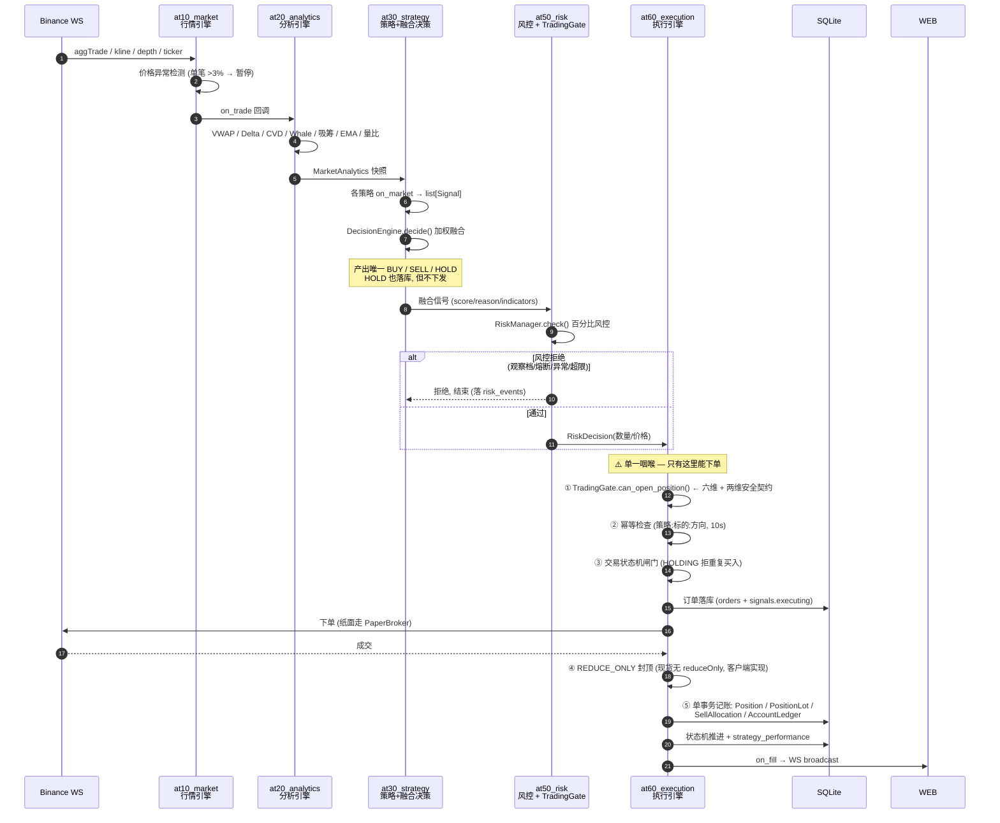
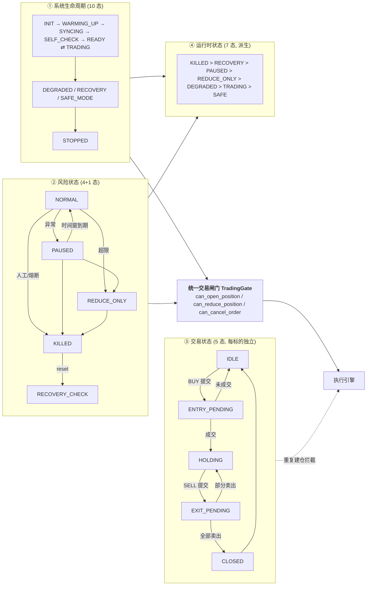
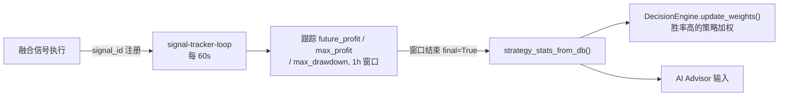

# 技术架构

> SOL/USDT 现货自动摆动交易系统 · Python 3.13 · asyncio **单进程**异步架构
>
> **怎么读这份文档**：§1 看整体分层 → §2 看一次成交怎么流过全链路 → §3 搞清四套状态机（最容易混）→
> §4 看后台任务 → §5 查包名 → §6 查数据表 → §7 看关键设计决策。
> 只想知道「现在能不能下单」，看 [`operating-modes-manual.md`](operating-modes-manual.md) §5。

---

## 1. 分层总图

**编号即阅读顺序 = 数据流顺序**：`at10_market`(行情进来) → `at20_analytics`(变成指标) →
`at30_strategy`(变成信号) → `at40_portfolio`(定仓位) → `at50_risk`(能不能过) →
`at60_execution`(发出去)。代号越大越靠后，十位是层号。

```
 Binance 现货  ·  WS 组合流 + REST /api/v3
 (现货没有 reduceOnly 参数 — 见 §7, 必须客户端实现)
    │
    │ tick
    ▼
 ┌─ 领域层: 主链路(编号即顺序, 十位=层号) ─────────────────────────────
 │
 │   L1  at10_market       行情接入    WS 重连 / 状态预热 / 数据校验
 │    →  L2  at20_analytics 分析        VWAP(σ通道) / CVD / Whale / 吸筹 / regime / alpha
 │    →  L3  at30_strategy  策略        Entry 评分 / Exit 分批止盈 / 多策略加权融合
 │    →  L4  at40_portfolio 组合        三桶(核心/交易/现金) / 成本曲线 / 核心仓低频管理
 │    →  L5  at50_risk      风控        TradingGate(六维+两维) / 生命周期 10 态 / 资金熔断
 │    →  L6  at60_execution 执行        幂等去重 / 交易状态机 / 下单(唯一咽喉) / 对账 / 账本
 │
 └──────────────────────────────────┬──────────────────────────────────
                                    │ 落库
                                    ▼
        SQLite + WAL(28 张表)   ·   Redis 可选, 默认关
                                    │
                                    │ 读运行时状态(SystemState 句柄容器)
                                    ▼
 ┌─ L9 展示层(横切) ───────────────────────────────────────────────────
 │
 │   at90_web   REST API · WS 推送 · 监控面板 · 管理控制台 · 部署自检页
 │   ⚠ 只读: 无任何下单端点; 急停/恢复也只调风控既有接口
 │
 └────────────────────────────────────────────────────────────────────

 编排层   run.py — AdaptiveTradingSystem(**唯一编排器**)
          装配(wiring, 委托) · 生命周期(runtime, 委托) · 11 个周期任务 · 信号回调

 辅助层   at70_journal    日报 / HODL 对标 / 交易日志      (旁挂, 不阻塞主链路)
 (旁挂)   at80_backtest   回测 / Walk-Forward              (离线)
          at85_optimizer  参数优化 → 只产 proposal, 需人工 activate

 L0 基础层  at01_common — **横切: 上面每一层都依赖它**
 (横切)     settings(启动审计) · models(28 表) · database(惰性引擎 + SQLite WAL)
            logger · timeframe(统一时间粒度) · migrations(前向迁移 + checksum + 并发锁)
            runtime_supervisor(任务监督) · runtime_health(七态) · schema_check(列漂移探测)
            mainnet_readiness(九项自检) · testnet_gate(执行闸门) · evidence_chain · soak
```

> **为什么这张图用 ASCII 而不是 Mermaid**：分层是**结构关系**（谁依赖谁），不是**流程**。
> Mermaid 的 `flowchart` 在跨子图连线时会覆盖子图的排列方向（实测 `direction LR` 失效，
> 整条领域链被竖着堆成 1800px 高一列，比原来的图更难读）。结构图用 ASCII 反而**永远渲染、
> 在终端与 git diff 里都能读**。后面的时序图 / 状态机图 / 闭环图是真正的流程，才用 Mermaid。

**依赖方向**：领域层向下依赖基础层；展示层只**读**运行时状态（`at90_web/web_state.py` 的
`SystemState` 句柄容器），**不下单**——Web 没有任何下单端点，急停/恢复也只调用风控既有接口。

---

## 2. 一次成交怎么流过全链路

### 2.1 实时主链路时序



**四个卡点**（任何一道不过就不下单）：`TradingGate` 六维闸门 → 幂等去重 → 状态机 → REDUCE_ONLY 封顶。

### 2.2 数据流的分叉点

`TradeTick` 从 WS 进来后分成五路，互不阻塞：

| 去向 | 说明 |
|------|------|
| 内存状态 | `trades` deque + `last_price`（分析引擎直接读） |
| 批量落库 | 5s 批量写 `trades` 表 |
| Redis pub-sub / Stream | **可选**，Redis 关闭时静默跳过（默认关） |
| `on_trade` 回调 | 主链路入口（§2.1） |
| WS 广播 | 推给 Web 面板 |

---

## 3. 四套状态机 —— 最容易混的地方

系统里跑着**四套独立的状态机**，管的是完全不同的事。混起来是读代码时最主要的困惑源：

| # | 状态机 | 位置 | 管什么 | 态数 |
|---|--------|------|--------|------|
| 1 | `SystemLifecycle` | `at50_risk/system_lifecycle.py` | **整个系统**处于什么阶段 | 10 |
| 2 | `RiskStateMachine` | `at50_risk/risk_state.py` | **风控**放不放行 | 4 + 1 |
| 3 | `TradeState` | `at60_execution/execution_state.py` | **单个标的**这一轮交易走到哪 | 5 |
| 4 | 运行时状态分类器 | `at01_common/runtime_health.py` | **面板上显示哪个词**（派生, 不存储） | 7 |



### 3.1 闸门到底是几维

`TradingGate` 的文档说「六维」，但 V11.6 的 **BUY 安全契约**又收了两维进来，实际是 **6 + 2**：

| # | 维度 | 来源 |
|---|------|------|
| 0 | `shutting_down` 停机窗口 | V11.6 补（防在途信号偷卖） |
| 0 | `critical_tasks_healthy` 关键任务健康 | V11.6 补 |
| 1 | `SystemLifecycle.can_trade` | 生命周期 READY/TRADING |
| 2 | `RiskState.can_trade` | 风险态 NORMAL |
| 3 | `market_data_healthy` | 行情有价、非静默 |
| 4 | `exchange_healthy` | 对账无 api_error、truth 完整 |
| 5 | `reconciled` | 最近对账无 actionable 差异 |
| 6 | `CircuitBreaker` | 资金熔断非 REDUCE_ONLY/PAUSE/KILL |

**方向语义**：

| 状态 | BUY | SELL/减仓 | 撤单 |
|------|-----|-----------|------|
| READY / TRADING + NORMAL | ✅ | ✅ | ✅ |
| DEGRADED / RECOVERY | ❌ | ✅（安全离场） | ✅ |
| SAFE_MODE | ❌ | ⚠️ 数据可信时才允许 | ✅ |
| KILLED | ❌ | ❌（急停冻结，且**不自动恢复**） | ✅ |
| STOPPED | ❌ | ❌ | ❌ |

### 3.2 优先级（谁压谁）

```
KILLED > RECOVERY > PAUSED > REDUCE_ONLY > DEGRADED > TRADING > SAFE
```

面板上的状态词由 `classify_runtime_status` **派生**，不单独存储 —— 所以不存在
「面板说能买、闸门说不能买」的分叉。`health.can_buy` 直接取自 `TradingGate`（单一权威）。

---

## 4. 后台任务

全部经 `at01_common/runtime_supervisor.py` 统一 spawn 并跟踪。`critical=True` 的任务一旦崩溃 →
**进入安全态 + 急停**（这是「异常绝不下单」的兜底）。

| 任务名 | 周期 | critical | 职责 |
|--------|------|:--------:|------|
| `risk-loop` | 5s | ✅ | 权益/回撤/日内亏损更新，行情静默检测 |
| `reconcile-loop` | `RECONCILE_INTERVAL_SECONDS` | ✅ | 对账矩阵判定 → 漂移分级 → 生命周期迁移 |
| `market-persist` | 5s | | trades / klines 批量落库（行情引擎内自管） |
| `snapshot-loop` | 60s | | 持仓快照 → `position_snapshot`（收益曲线） |
| `signal-tracker-loop` | 60s | | 信号未来收益 → `signal_result`（1h 窗口，喂 AI 学习） |
| `regime-loop` | `REGIME_WATCH_INTERVAL` | | 市场环境评估（BULL/BEAR/…）注入分析快照 |
| `portfolio-loop` | `PORTFOLIO_REBALANCE_INTERVAL_SECONDS` | | 核心仓低频决策 + 再平衡 |
| `ai-loop` | `AI_INTERVAL_SECONDS`（日） | | AI 参数建议（**只建议，不下单**） |
| `daily-report-loop` | 86400s | | 每日复盘 → `reports/YYYY-MM-DD.md` |
| `sentiment-loop` | `SENTIMENT_POLL_INTERVAL_SECONDS` | | 情绪因子轮询（**默认关**） |
| `web-server` | — | | FastAPI/uvicorn 内嵌启动 |

### 4.1 信号自学习闭环



---

## 5. 模块分层与包名

> 编号 = 阅读顺序 = 数据流顺序。**十位是层号，个位 0 = 主，5 = 同层辅助**（80 回测 / 85 优化）。
> 2026-09-12 从旧编号重排而来（旧 `at50_strategy` 与 `at50_execution` 撞号，且 execution 排在 risk
> 之后却号更小），映射见 [`tasks/README.md`](tasks/README.md)。

| 目录 (= 包名) | 层 | 模块 |
|------|----|------|
| `at01_common` | **L0 基础**(横切) | settings（含 `validate()` 启动审计）/ database（惰性引擎 + SQLite WAL/busy_timeout/foreign_keys）/ logger / models（28 表）/ timeframe（统一时间粒度）/ migrations（前向迁移 + checksum + 并发锁）/ runtime_supervisor / runtime_health / mainnet_readiness / testnet_gate / evidence_chain / soak / schema_check / bootstrap / wiring / runtime |
| `at10_market` | **L1 行情接入** | market_engine / market_models / market_rest_client / market_ws_client / data_validator / market_futures_client |
| `at20_analytics` | **L2 分析** | engine / indicators（VWAP σ通道、Delta、CVD 斜率）/ whale（P99 动态）/ accumulation（4 规则）/ regime（六态）/ alpha / regime_hmm / sentiment / bus（EventBus，Redis 可选） |
| `at30_strategy` | **L3 策略** | strategy_engine / strategy_base / strategy_buy（entry）/ strategy_sell（exit）/ strategy_grid / strategy_trend / strategy_decision（未知权重拒绝）/ strategy_identity / strategy_journal / strategy_signal_tracker / strategy_ai_advisor / strategy_version / strategy_group / ai_parameter_guard / llm_config |
| `at40_portfolio` | **L4 组合** | core_manager（核心仓低频管理）/ portfolio_manager（成本曲线） |
| `at50_risk` | **L5 风控** | risk_manager / trading_gate（**单一权威闸门**）/ system_lifecycle（10 态）/ fund_circuit_breaker（三向漂移）/ risk_state / risk_breaker / risk_drawdown / risk_position / risk_portfolio / risk_allocation / risk_buckets / risk_tiered / risk_sizing / risk_ledger / risk_account_ledger / risk_lot / risk_killswitch |
| `at60_execution` | **L6 执行** | execution_executor（**唯一下单咽喉**）/ execution_paper_broker / execution_state（状态机）/ execution_events / fee_calculator / ledger_reconstruction / order_recovery / cross_reconciler / exchange_truth_reconciler / reconciliation / reconciliation_matrix / startup_reconciler / drift / exchange_filters / observability |
| `at70_journal` | **L7 记录** | daily_report / trading_journal / hodl_benchmark |
| `at80_backtest` | **L8 研究** | backtest_portfolio（真实策略管线 + 滑点 + 次 bar）/ backtest_execution（Slippage / NextBar / AsOf）/ backtest_engine / backtest_run / backtest_walkforward / backtest_optimizer / backtest_robustness |
| `at85_optimizer` | **L8 研究** | optimizer / report（只产 proposal，`active=False`，需人工 `activate`） |
| `at90_web` | **L9 展示**(横切) | web_app / web_api_routes / web_admin_routes / web_operator_status / web_ws_stream / web_state / web_serve_standalone / web_auth / static |
| `run.py`（根） | **编排层** | `AdaptiveTradingSystem`：装配（委托 `wiring`）+ 生命周期（委托 `runtime`）+ 信号回调 |
| `Dockerfile` / `docker-compose.yml`（根） | 部署 | V11.8 生产运行时（多阶段 uv + tini PID1 + 非 root + SQLite 持久化卷）。**必须留在根目录**（compose 卷用相对路径）；部署资产在 `deploy/` |

---

## 6. 数据库模型（28 张表）

> 权威定义在 `at01_common/models.py`；`tests/unit/test_v129_schema_audit.py` 钉死全列清单，
> 防止 `create_all` 静默列漂移。结构变更需同步三处，见 [`database-migration.md`](database-migration.md)。

| 分组 | 表 | 用途 / 关键字段 |
|------|----|----------------|
| **行情** | `klines` | K线（symbol+interval+open_time 唯一） |
| | `trades` | 逐笔成交（symbol+trade_id 唯一） |
| **决策** | `signals` | 策略信号（score / reason / indicators JSON / status） |
| | `decision_log` | 决策日志（regime / 置信 / Alpha / 双仓 / 现金） |
| | `signal_result` | 信号未来收益跟踪（future_profit / max_profit / final） |
| | `strategy_performance` | 策略绩效（win_rate / profit，strategy+symbol 唯一） |
| | `strategy_versions` | 策略版本迁移审计 |
| **执行** | `orders` | 订单（client_order_id 唯一 / signal_id / reduce_only / accounting_state） |
| | `order_intents` | 下单意图，幂等去重（intent_id 唯一） |
| | `order_fills` | 逐笔成交明细（fill_idempotency_key 唯一） |
| | `execution_attempts` | 执行尝试记录 |
| | `execution_events` | 执行事件审计（append-only） |
| | `trade_state` | 交易状态机当前态 |
| | `paper_state` | 纸面持仓 |
| **账务** | `positions` | 持仓账务（avg_price / realized_pnl / peak_price） |
| | `position_lots` | FIFO 持仓批次（剩余数量 + 单位成本） |
| | `sell_allocations` | FIFO 卖出分配（lot_id / quantity） |
| | `account_ledger` | 现金/持仓逐笔流水（**仅纸面落库**，实盘锚定交易所真相） |
| | `position_bucket` | 双仓（core / trade 独立数量 + 成本 + target_ratio） |
| | `position_snapshot` | 持仓快照（60s 采样，出收益曲线） |
| | `trade_records` | 已平仓交易（开平仓价 / realized_pnl） |
| **风控** | `risk_events` | 风控事件（type / detail / equity） |
| | `kill_switch_state` | 急停开关（**单行 id=1 持久化**，重启不自动恢复） |
| **AI** | `ai_advices` | AI 建议（只建议，不下单） |
| | `ai_parameter_history` | AI 参数历史（旧值 / 新值 / 原因 / 效果） |
| **对标** | `hodl_benchmark` | HODL 基准（单行；接管基线 + 每日对标） |
| **配置** | `runtime_config` | 运行参数覆盖（DB > env > default；密钥与 bootstrap 关键项不入库） |
| | `runtime_config_history` | 配置变更审计（append-only；谁在何时把哪个值改成了什么） |

---

## 7. 关键设计决策

| 决策 | 理由 |
|------|------|
| 单进程 asyncio（非微服务） | 交易链路毫秒级延迟要求，避免跨进程序列化 |
| 目录 = 包名（`atXX`，编号即分层） | import 路径自解释阅读顺序；`run.py` 用 `bootstrap.inject_sys_path()` 注入（扁平布局，无 build-system） |
| **单一咽喉**：`ExecutionEngine.execute()` | 全系统唯一下单点（仅 `run.py` 两处经闸门调用），无 bypass、无反射动态下单 |
| **单一权威**：`TradingGate` | 交易许可只此一处判定；`/api/metrics` 的 `can_buy` 直接取它，绝不虚报「可买」 |
| **现货不是合约** | 走 `/api/v3/*`（非 `/fapi`）。币安现货**没有 `reduceOnly` 参数**，「卖出不得超持仓」必须客户端实现（REDUCE_ONLY 闸门） |
| 纸面模式默认 | `PAPER_TRADING=true` 出厂默认，真实资金不会被误用 |
| 真钱交易主网默认必拦 | `PAPER_TRADING=false` + `BINANCE_TESTNET=false` 且未显式 `LIVE_TRADING_CONFIRM=true` → 启动拦截；V11.8 追加九项 `mainnet_readiness_check`，`MAINNET_API_SCOPE_CONFIRM` 默认 false。V12.6：判定条件由「是否连主网」改为「**是否可能用真钱下单**」—— 主网观察(纸面+主网行情)无下单能力, 放行 |
| AI 只建议不交易 | 规则负责实时决策，AI 负责慢速参数优化；优化器只产 proposal（`active=False`），`activate` 需人工 |
| 回测 = 实盘同一份策略代码 | 回测驱动真实 `StrategyEngine`，禁止内嵌第二套策略 |
| 次 bar 执行 | 信号 t 收盘 → t+1 开盘成交，杜绝 look-ahead |
| 滑点敏感性显式化 | 执行模型显式 bps，回测按 0/10/20bps 报告 |
| 未知配置拒绝 | 无权重策略跳过而非静默默认值 |
| 惰性 DB 引擎 | `reset_engine` 支持测试隔离（内存 SQLite） |
| EventBus 降级 | Redis 不可用时静默跳过，主链路走内存回调 |
| 实盘财务真相 = 交易所对账链 | `LIVE_ACCOUNT_LEDGER_MODE = EXCHANGE_TRUTH_RECONCILIATION`。不在实盘补写 `account_ledger` —— 同步镜像本地现金会引入二次漂移源，且现金维度已由权益对账兜底 |
| 状态模型区分「已实现」与「已执行」 | IMPLEMENTED / READY_TO_RUN / EXECUTED / PASSED / FAILED / BLOCKED / NOT_EXECUTED 七态，不把「代码写了」说成「跑通了」 |

---

## 8. 架构演进

> 每版的完整交付与验证记录见 [`progress.md`](progress.md)（当前态）与 [`progress-archive.md`](progress-archive.md)（历史）。
> 本节只记**架构层面**的变更。

| 版本 | 架构级变更 |
|------|-----------|
| V1.0–V8 | 五引擎全链路（行情→分析→策略→风控→执行）+ 双仓模型 + 回测引擎 |
| V9.0 | Regime 六态 + 策略整合 + 优化器 + HMM/情绪可选模块 |
| V10.x | 订单→成交→账本链；FIFO Lot 会计；三维交叉对账；急停端点到**持久化** |
| V11.0 | 深度审计 F1–F13（13 项资金正确性缺陷）：记账原子性 / 成交分页 / lot 幂等 / 成交流口径统一 |
| V11.1 | 交易所真相重建账务 + 手续费统一计价 + 对账矩阵（四态判定，**单一对账器不得 kill**）+ 顶层生命周期 |
| V11.2 | **系统集成层**：`TradingGate` 六维闸门 + 10 态生命周期 + 资金熔断执行链 + 对账矩阵接线（故障 → 闸门最终态闭环） |
| V11.3 | 生产加固：单币冻结 / `Settings` fail-fast / Recovery 重启语义 / DB 一致性 / 主网守卫 |
| V11.4 | 运行时验证：长跑 soak + 异常绝不 BUY + 恢复状态机穷举 + run.py 监督审计 + CI ruff/coverage 门禁 |
| V11.5 | 运维加固：Web 写接口令牌鉴权 / `RuntimeSupervisor` / 运行时健康快照 / 故障注入 |
| V11.6 | **财务真相闭环**：BUY 安全契约（闸门补两维）/ `AccountLedger` 实盘边界 / 前向迁移框架 / run.py 瘦身（bootstrap + wiring + runtime） |
| V11.7 | 测试网证据：七态状态模型 / soak 优雅停机与验收契约 / 迁移 checksum + 并发锁 / 证据链 / 测试网真实执行闸门 |
| V11.8 | Docker 生产运行时（多阶段 + tini + 非 root）/ SQLite 生产 pragma / **主网就绪自检九项** |
| V12.x | 小资金主网接管接线 / Pi arm64 部署 / Web 三入口（`/` `/admin` `/ops`）/ 包名按阅读顺序重编号 |

**冻结不变**（任何改动都不得触碰）：Binance 单所 · SOLUSDT 单币 · **Spot 现货（非合约）** ·
双仓 · 低频 · AI 只分析优化不直接下单。**禁止新增交易策略 / 币种 / 合约 / 高频 / LLM 下单。**
