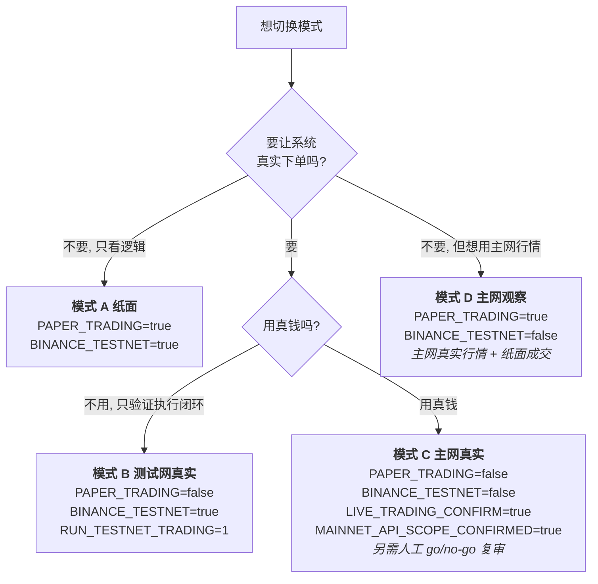

# 运行模式使用与运维手册

> 本文是「**按模式选配置 + 按模式运维**」的单一入口。所有判据均取自代码
> (`at01_common/settings.py` / `testnet_gate.py` / `mainnet_readiness.py` / `wiring.py` /
> `at50_risk/trading_gate.py`)，不是经验总结。
>
> 分工：通用启动/排障/API 速查见 [runbook.md](runbook.md)；测试网无人值守专册见
> [testnet-runbook.md](testnet-runbook.md)；主网专册见 [mainnet-runbook.md](mainnet-runbook.md)；
> 容器与 Pi 见 [docker-deployment.md](docker-deployment.md) / [raspberry-pi-deployment.md](raspberry-pi-deployment.md)。

---

## 0. 操作者视角：只有三种模式（V12.7 起）

在 `/admin` 顶部选一个即可 —— **不需要理解任何底层开关**：

| 模式 | 含义 | 真实下单 | 底层等价 |
|------|------|:--------:|----------|
| **模拟** | 本地模拟成交 | ❌ | `PAPER_TRADING=true` |
| **测试网** | 测试网真实下单(假钱) | ✅ | `PAPER_TRADING=false` + `BINANCE_TESTNET=true` + `RUN_TESTNET_TRADING=1` |
| **实盘** | 主网真实资金 | ✅ **真钱** | `PAPER_TRADING=false` + `BINANCE_TESTNET=false` + 两道确认 |

**唯一需要设的模式开关**：

```ini
TRADING_MODE=paper        # 或 testnet / live
```

留空则按旧开关推导(兼容老 `.env`); 新旧配置明显冲突时**拒绝启动, 不静默选择其一**。
解析逻辑见 `at01_common/trading_mode.py`。

> **行情数据源与模式正交**：「模拟 + 主网真实行情」是**高级选项**(真实流动性, 但不下单),
> 不是第四种模式。见 §0.5。

---

## 0.1 底层判据（高级配置，一般不用看）

判据只有两个布尔量：`PAPER_TRADING` 与 `BINANCE_TESTNET`。

| 模式 | 判据 | 真实下单? | 连哪家交易所 | 用途 |
|------|------|-----------|--------------|------|
| **A 纸面** | `PAPER_TRADING=true` | ❌ 模拟成交 | 行情连交易所，下单不发出 | 出厂默认、策略迭代、长期验证 |
| **B 测试网真实执行** | `PAPER_TRADING=false` + `BINANCE_TESTNET=true` + `RUN_TESTNET_TRADING=1` | ✅ 真实下单 | `testnet.binance.vision` | 端到端执行闭环、soak |
| **C 主网实盘** | `PAPER_TRADING=false` + `BINANCE_TESTNET=false` + `LIVE_TRADING_CONFIRM=true` | ✅ 真实下单 | `api.binance.com` | 极小资金真实运行（需人工 go/no-go） |

> **模式 A 的边界**：只有「下单」被模拟。行情、分析、策略、风控、生命周期、生命周期闸门、
> 每日复盘与实盘**完全同一条代码路径**；持仓对账器不接 REST（退化为纸面现金自检）。
> 所以纸面能验证的是「逻辑与状态机」，不能验证的是「交易所真实行为（拒单/部分成交/滑点/API 限流）」。

**跨模式不变量（三种模式都成立）**
- 冻结产品边界：单交易所 Binance / 单币种 SOLUSDT / **现货（非合约）** / 双仓 / 低频。
  `SYMBOLS` 非 SOLUSDT 会被 `validate()` 直接拒绝启动。
- **唯一的下单咽喉是 `ExecutionEngine.execute()`**，且只经 `TradingGate` 放行；Web 无下单端点，
  AI 只写 `ai_advices`，不参与下单路径。
- 风控/急停/对账在任何模式下都不关闭。

---

## 0.5 一页纸速查：我在哪个模式 / 怎么切

### 四种开关组合 —— 但只有三种能启动

`PAPER_TRADING` 和 `BINANCE_TESTNET` 两个布尔量组合出四种，**四种都可以启动**：

| # | `PAPER_TRADING` | `BINANCE_TESTNET` | 还必须显式设置 | 名称 | 真实下单 | 连哪 | 守卫 |
|---|:---:|:---:|---|------|:---:|------|------|
| **A** | `true` | `true` | — | **纸面** | ❌ 模拟 | 测试网行情 | ✅ 放行（出厂默认） |
| **B** | `false` | `true` | `RUN_TESTNET_TRADING=1` | **测试网真实** | ✅ | `testnet.binance.vision` | ✅ 放行（另需测试网 key/secret 齐备） |
| **C** | `false` | `false` | `LIVE_TRADING_CONFIRM=true`<br/>`MAINNET_API_SCOPE_CONFIRMED=true` | **主网实盘** | ✅ **真钱** | `api.binance.com` | ⚠️ 九项自检全绿 + 人工 go/no-go |
| **D** | `true` | `false` | — | **主网观察** | ❌ 模拟 | 主网行情 | ✅ 放行（无真钱能力） |

> **关于模式 D（V12.6 起可启动）**：它用**主网真实行情** + 本地模拟成交。
> 此前被两道守卫拦着，那两道守卫**挂错了条件** —— 挂在「是否连主网」上，而该模式
> 根本**没有真钱能力**：下单走 `PaperBroker`、三个用 REST 的对账器都是 `rest_client=None`、
> `validate()` 也不要求主网凭证。现已改挂在「**是否可能用真钱下单**」上。
>
> **放宽它没有打开任何意外真钱交易的路径**：从 D 改成主网真实需要 `PAPER_TRADING=false`，
> 那会再次进入 `mainnet_blocked_reason()` 且**仍会被拦**（除非显式确认）。
> 模式 C 的门槛**一项不减**。
>
> 它的用处：测试网的盘口稀薄、人造；想看真实的流动性与微观结构，用 D。

### 切换决策图



### 切换路径速查

四种模式**互不依赖**，任意两种之间都可直接切（改开关 → 重启）：

| 想干什么 | 开关怎么改 | 备注 |
|----------|-----------|------|
| 只看逻辑，不连真实盘口 | `PAPER_TRADING=true` + `BINANCE_TESTNET=true` | 模式 A，出厂默认 |
| 用**真实盘口**验证策略，但不下真单 | `PAPER_TRADING=true` + `BINANCE_TESTNET=false` | 模式 D，V12.6 起可用 |
| 验证真实下单闭环（假钱） | `PAPER_TRADING=false` + `BINANCE_TESTNET=true` + `RUN_TESTNET_TRADING=1` | 模式 B |
| 真实资金交易 | `PAPER_TRADING=false` + `BINANCE_TESTNET=false` + 两道确认 | 模式 C，见 [§9.3](#93-b--c开启主网实盘必须人工复核) |

> ⚠️ **任何切换都必须重启才生效**（配置在启动时读取），且**回退不会自动解除急停** ——
> 急停态持久化在 `kill_switch_state` 表，需人工确认后再 `recover`。

### 三种方式改配置

| 方式 | 适用 | 说明 |
|------|------|------|
| `/admin` 页面 | 日常 | 草稿 → 预览（只校验不写盘）→ 保存（写前自动备份）。**页面绕过不了任何守卫**，见 §5.y |
| 直接改 `.env` | 本地开发 | 改完重启；本地默认 `.env` 在仓库根（已 gitignore） |
| 直接改 `/etc/adaptive-trading/production.env` | Pi 生产 | 容器外的外置配置，改完 `docker compose restart`；需容器用户可写，见 [raspberry-pi-deployment.md](raspberry-pi-deployment.md) |

### 怎么确认切成功了

**唯一权威**是 `/api/operator-status` 的 `mode` 字段（不是日志里你期望看到什么）：

```bash
curl -s http://<host>:8800/api/operator-status | python -c "import sys,json; d=json.load(sys.stdin); print(d['mode'], '|', d['mode_label'], '| can_buy=', d['can_buy'])"
```

| 期望模式 | `mode` 应为 | `mode_label` |
|----------|------------|--------------|
| A | `paper_testnet` | 纸面 + 测试网 |
| B | `live_testnet` | 测试网真实 |
| C | `live_mainnet` | 主网真实 |

**外加启动日志里的守卫报告**（搜这两行标题，有 `BLOCKED:` 就是没起来）：
- 模式 B：`=== TESTNET PREFLIGHT ===`
- 模式 C：`=== MAINNET READINESS ===`

⚠️ 注意 `mode` 只说明**配置是什么**；**能不能下单**要看同一个响应里的 `can_buy` / `can_sell` ——
它直接取自 `TradingGate`，与面板、`/ops` 同源。**两者不一致时以 `can_buy` 为准。**

---

## 1. 启动守卫链：决定「能不能起来」

按 `at01_common/wiring.py::wire_system()` 的**实际顺序**执行，任一关失败即
`RuntimeError` → **拒绝启动**（不是降级运行）：

```
1. settings.validate()                 配置审计
2. settings.mainnet_blocked_reason()   默认禁主网
3. mainnet_readiness_check()           主网九项自检   ← 仅当 **真钱交易**(非纸面 + 连主网)
4. testnet_preflight()                 测试网真实执行闸门
5. 载入 DB + kill_switch.load_from_db()  恢复持久化急停态
```

| 关 | BLOCKED 条件（任一命中） | 报告块 |
|----|--------------------------|--------|
| 1 配置审计 | 实盘却缺对应环境的 API key/secret；标的非 SOLUSDT；三桶比例和 ≠ 1.0；风控阈值不在 (0,1]；回撤档位非严格递增；**非回环 `API_HOST` 但 `WEB_ADMIN_TOKEN` 为空**；端口非法；无启用策略；DB 地址为空等 | 日志 `生产配置审计未通过` |
| 2 默认禁主网 | `BINANCE_TESTNET=false` 且 `LIVE_TRADING_CONFIRM != "true"` | 日志 `拒绝主网启动` |
| 3 主网九项(仅真钱交易时) | ①非主网 ②`paper_trading=true` ③`LIVE_TRADING_CONFIRM!=true` ④`MAINNET_API_SCOPE_CONFIRM!=true` ⑤标的非 SOLUSDT ⑥配置审计有项 ⑦急停已冻结 ⑧`git_sha` 为空 ⑨端点不含 `api.binance.com` | `=== MAINNET READINESS ===` |
| 4 测试网闸门 | 纸面模式 → 直接放行（`mode=paper`）；非纸面时须**同时**满足：`BINANCE_TESTNET=true` + `live_trading=false` + `RUN_TESTNET_TRADING=1` + 测试网 key/secret 齐备 | `=== TESTNET PREFLIGHT ===` |

> 第 3 关的 `kill_switch_armed` 传 `False`（此刻尚未从 DB 载入），急停态由第 5 步之后的
> 生命周期守卫兜底：**已武装 → 停在 `READY` 不交易**。两处互不重复。

**看报告**：启动日志里搜 `=== MAINNET READINESS ===` / `=== TESTNET PREFLIGHT ===`，
`BLOCKED:` 行会逐条列出原因。**不要 bypass —— 逐条修配置后重启。**

---

## 2. 模式 A：纸面（Paper）

### 配置
```ini
PAPER_TRADING=true
BINANCE_TESTNET=true          # 行情走测试网流
PAPER_INITIAL_CASH=100000     # 纸面初始资金 USDT
PAPER_FEE_RATE=0.001          # 纸面手续费率
RUN_TESTNET_TRADING=           # 留空 —— 有值也不影响(纸面直接放行)
```
无需任何 API key（`validate()` 只在 `PAPER_TRADING=false` 时才要求凭证）。

### 启动与验收
```bash
python run.py                                   # 本地裸跑
docker compose up -d                            # 或容器
curl -fsS http://127.0.0.1:8800/api/health      # {"status":"ok","running":true}
curl -fsS http://127.0.0.1:8800/api/metrics     # 看 health.can_buy / state
```
预期：`=== TESTNET PREFLIGHT ===` 中 `paper_trading=true`，**无 BLOCKED 行**。

### 能用 / 不能用
- ✅ 策略与参数迭代、风控与生命周期演练、对账链路演练、每日复盘、面板全功能。
- ❌ 不能证明交易所侧真实行为：拒单、部分成交、`-2010` 类下单错误、真实滑点、API 权重限流。
- ⚠️ 纸面资金是**纯账面**：`AccountLedger` 仅纸面落库，实盘锚定交易所真相对账。

---

## 3. 模式 B：测试网真实执行（Real Testnet）

### 配置
```ini
PAPER_TRADING=false
BINANCE_TESTNET=true
RUN_TESTNET_TRADING=1                        # 显式 opt-in, 少了这行启动即 BLOCKED
BINANCE_TESTNET_API_KEY=<testnet key>
BINANCE_TESTNET_API_SECRET=<testnet secret>
LIVE_TRADING_CONFIRM=                        # 必须保持空 —— 置 true 会触发闸门拒绝
BINANCE_API_KEY=                             # 主网凭证一律留空
BINANCE_API_SECRET=
STARTUP_RECONCILE_ENABLED=true               # 实盘必开
```
> `live_trading=true` 会被第 4 关判定为 `主网实盘, 测试网闸门禁止` → BLOCKED。
> 这是刻意的：**测试网闸门与主网守卫互斥**，不可能「配错一个变量就连上主网下单」。

### 启动与验收
```bash
python run.py            # 或 docker compose --env-file /etc/adaptive-trading/production.env up -d
```
预期报告：
```
=== TESTNET PREFLIGHT ===
symbol=SOLUSDT  paper_trading=false  binance_testnet=true  live_trading=false
git_sha=<完整 SHA>  credentials_present=true
```
无 `BLOCKED:` 行 = 放行。

### 无人值守 soak
```bash
python -m at01_common.soak --hours 7 [--paper] [--port 8800] [--interval 60] [--no-launch]
```
- 默认 `PAPER_TRADING=false`（**真实下单**）；加 `--paper` 才是纸面 soak。
- `--no-launch` 只采样已运行实例，不另起 `run.py`。
- 证据落 `logs/soak/<run_id>/evidence.jsonl`；验收契约见 `at01_common/soak.py::evaluate_soak_result`。

### 能用 / 不能用
- ✅ 真实下单→成交→账本→对账全闭环；崩溃恢复、UNKNOWN 订单收敛、部分成交。
- ❌ 测试网流动性/撮合与主网不同，**不能**据此推断主网滑点与成交质量。
- ⚠️ 测试网余额是水龙头发的，资金曲线无参考价值。

---

## 4. 模式 C：主网实盘（Mainnet）

### 配置
```ini
PAPER_TRADING=false
BINANCE_TESTNET=false                        # 连主网
BINANCE_API_KEY=<主网 key, Spot only, 关提现/关资金转移>
BINANCE_API_SECRET=<主网 secret>
LIVE_TRADING_CONFIRM=true                    # 守卫 2: 必须显式 true
MAINNET_API_SCOPE_CONFIRM=true               # 守卫 3 第④项: 人工核对 key 权限后置 true
MAINNET_READINESS_ENABLED=true
MAINNET_TAKEOVER_ENABLED=true                # 首次只读接管(账户快照+对账+HODL 基线)
STARTUP_RECONCILE_ENABLED=true
EQUITY_RECONCILE_TOLERANCE_PCT=0.02
# 首次小资金: 由操作者填入经书面批准的保守上限, 不得留空
RISK_MAX_POSITION_PCT=
RISK_MAX_SINGLE_ORDER_PCT=
RISK_MAX_SOL_EXPOSURE=
RISK_MAX_DAILY_LOSS=
RISK_MAX_DRAWDOWN=
RISK_INITIAL_EQUITY=
```
> `BINANCE_API_KEY` 权限**无法由 API 自证**，所以第④项只能是人工核对后的显式开关，
> 默认 `false` → 主网默认必拦。

### 启动会依次发生
1. 守卫 1/2/3 全部放行 → 打印 `=== MAINNET READINESS ===`（9 行全绿）。
2. **首次只读接管**（仅当尚无 HODL 基线）：账户快照 + 对账 + 记录基线。
   接管**未通过 → 自动武装急停**，不带着未确认的仓位开始交易。
3. **启动对账**：崩溃窗口恢复；有未解决差异 → **自动武装急停**。
4. 生命周期推进：急停已武装则停在 `READY`（不交易），否则进 `TRADING`。

### 上线纪律（不可妥协）
- **CC / 自动化不得自行批准首笔主网交易** —— 必须由操作者单独 go/no-go 并留记录。
- 首次建议**观察 ≥ 24h 不下单**，确认行情/对账/健康快照稳定。
- 资金递增：只有当前级别连续稳定 + 对账恒平衡 + 无 `KILLED` 才可小幅递增，且重过
  [mainnet-readiness.md](mainnet-readiness.md) 复审。
- **禁止**：一次性放大资金 / 杠杆 / 合约 / 加币种 / 高频 / LLM 自动下单。

---

## 5. 运行时状态：一个词回答「现在能不能下单」

### 权威字段
`GET /api/metrics` → `health`：

| 字段 | 含义 |
|------|------|
| `status` | 单一运行状态：`KILLED` / `RECOVERY` / `PAUSED` / `REDUCE_ONLY` / `DEGRADED` / `TRADING` / `SAFE` |
| **`can_buy` / `buy_block_reason`** | **权威**：直接取自 `TradingGate.can_open_position()`，绝不虚报「可买」 |
| **`can_sell` / `sell_block_reason`** | 权威：取自 `TradingGate.can_reduce_position()` |
| `lifecycle.state` | 十态机：`INIT→WARMING_UP→SYNCING→SELF_CHECK→READY⇄TRADING`，`DEGRADED`/`RECOVERY`/`SAFE_MODE`/`STOPPED` |
| `risk.state` | 五态：`NORMAL`/`REDUCE_ONLY`/`PAUSED`/`KILLED`/`RECOVERY_CHECK` |
| `kill_switch.armed` + `.reason` | 持久化急停（**不自动复位**，重启后仍冻结） |
| `breaker.fund_action` | 资金熔断档位：`NONE`/`REDUCE_ONLY`/`PAUSE`/`KILL` |
| `reconcile.reconciled` / `market.connection_ok` / `market.data_healthy` / `exchange.healthy` | 四个健康维 |
| `tasks.running` / `tasks.failed` | 关键后台任务健康（崩溃 → 禁开仓） |

### `status` 分类优先级（`classify_runtime_status`）
```
KILLED      急停已武装 / lifecycle=SAFE_MODE|STOPPED / risk=KILLED
  ↓
RECOVERY    risk=RECOVERY_CHECK / lifecycle=RECOVERY
  ↓
PAUSED      risk=PAUSED / 熔断器打开 / fund_action∈{PAUSE,KILL}
  ↓
REDUCE_ONLY risk=REDUCE_ONLY / fund_action=REDUCE_ONLY
  ↓
DEGRADED    lifecycle=DEGRADED
  ↓
TRADING     lifecycle=TRADING          ← 唯一「正常可开仓」
（其余）    SAFE
```

### 闸门（`TradingGate`，开仓必须**六维全绿 + 两项前置**）
`SystemLifecycle.can_trade` ∧ `RiskState.can_trade` ∧ 行情健康 ∧ 交易所健康 ∧ 对账健康 ∧ 资金熔断。
外加两项前置：**非停机窗口** ∧ **关键后台任务健康**。
三接口：`can_open_position()` / `can_reduce_position()` / `can_cancel_order()`（撤单是风险收敛动作，
除 `STOPPED` 外放行）。
**方向语义**：`SAFE_MODE` 禁买、数据可信时允许安全减仓；`KILLED` 买与卖**都禁**（急停冻结）。

### 5.x 在 Dashboard 上看这些

不用记字段名，打开面板看两处即可：

| 位置 | 回答什么 |
|------|----------|
| **首屏「运行结论卡」** | 当前模式（纸面 / 测试网真实 / 主网）、当前状态中文解释、买入与卖出许可、阻断原因、下一步建议 |
| **「当前配置解释」卡** | `PAPER_TRADING` / `BINANCE_TESTNET` / `LIVE_TRADING_CONFIRM` / `MAINNET_API_SCOPE_CONFIRM` 的人话含义，以及写操作是否启用 |
| **`/ops` 部署检查页** | 只读自检（PASS / WARN / BLOCKED）：版本可追溯、`/api/health`、`/api/metrics.health`、写令牌、最近对账、最近错误 |

结论卡的数据来自 `GET /api/operator-status`（只读聚合）。它的 `can_buy` / `can_sell` 与 `status`
**直接取自同一份 `runtime_health`**（其本身取自 `TradingGate`），展示层不重新判定交易许可 ——
所以面板显示「禁止买入」时，引擎侧一定也是禁止的，不存在两套口径。

颜色对应关系：绿/灰 = 纸面或安全；橙 = 测试网真实或降档状态；**红 = 主网真实资金或急停冻结**。

> 注意：Compose 的 `healthy` **不等于**「可买入」。容器健康只说明 HTTP 服务可达；
> 能不能交易只看结论卡的「买入许可」。

### 5.y 在 `/admin` 里理解和切换模式

`http://<host>:8800/admin` 是**改配置**的地方（`/` 只看状态，`/ops` 只做上线前自检）。

页面上四张模式卡片，点一下就把对应开关填进下方表单；**但要点「保存配置」才真正落盘**：

| 卡片 | 开关组合 | 能否启动 |
|------|----------|----------|
| 纸面模式 | `PAPER_TRADING=true` + `BINANCE_TESTNET=true` | ✅ 可启动（出厂默认） |
| 测试网真实 | `PAPER_TRADING=false` + `BINANCE_TESTNET=true` | ✅ 可启动（还需 `RUN_TESTNET_TRADING=1`） |
| 主网观察 | `PAPER_TRADING=true` + `BINANCE_TESTNET=false` | ✅ 可启动（V12.6 起；主网行情 + 纸面成交） |
| 主网真实 | `PAPER_TRADING=false` + `BINANCE_TESTNET=false` + `LIVE_TRADING_CONFIRM=true` | ⚠️ 需两道确认齐全 |

> **「主网观察」V12.6 起可用**：它用主网真实行情 + 本地纸面成交，**没有真钱能力**
> （下单走 PaperBroker、对账器全是 `rest_client=None`）。原先两道守卫挂在「是否连主网」上，
> 属挂错条件，现已改挂在「**是否可能用真钱下单**」。
> **模式「主网真实」的门槛一项不减** —— 仍须两道显式确认 + 九项就绪自检。

**改配置的三段式**（`草稿 → 预览 → 保存`）：

1. **改**：开关/参数直接在页面上调；百分比参数按**百分数**输入（填 `3` 表示 3%，不用猜 `0.03`）。
2. **预览改动**：只校验、只展示，**不写文件**。会列出「当前 → 改为」的 diff、
   风险提示（关掉对账/连主网等标红）、以及校验不通过的具体项。
3. **保存配置**：可编辑字段**写入数据库**（`runtime_config` 表，优先级 DB > env > default），
   密钥类仍写配置文件；并明确提示**需要重启才生效**。
   > Pi 上因此**不再需要**挂载可写配置目录（此前要 `chown -R 999:999 /etc/adaptive-trading`）。

**安全边界**（页面无法越过的红线）：
- `LIVE_TRADING_CONFIRM` 与 `MAINNET_API_SCOPE_CONFIRM` **必须人工显式确认**，页面不能代为设置成"可用"；
  缺任一项，主网真实模式的草稿会被守卫直接拒绝，**文件一个字都不会被改**。
- 校验复用 `settings.validate()` / `mainnet_blocked_reason()` / `mainnet_readiness_check()`，
  与正常启动时的判定**同源**，不是另写一套。
- 密钥类字段（`*_KEY` / `*_SECRET` / `*_TOKEN`）**不可编辑、不回显**，只显示「已配置 / 未配置」。
- `SYMBOLS` 已冻结为 SOLUSDT，页面只读。

**保存后如何生效 / 如何回滚**：见 [runbook.md](runbook.md) §配置保存与回滚。

---

## 6. 运维动作速查

### 6.1 写接口（全部需 `X-Admin-Token` 头）
```bash
TOKEN=$(grep -E '^WEB_ADMIN_TOKEN=' /etc/adaptive-trading/production.env | cut -d= -f2-)
BASE=http://127.0.0.1:8800

curl -fsS -X POST -H "X-Admin-Token: $TOKEN" $BASE/api/emergency/kill      # 急停: 冻结 + 撤全部挂单
curl -fsS -X POST -H "X-Admin-Token: $TOKEN" $BASE/api/emergency/recover   # 解除急停(唯一解冻方式)
curl -fsS -X POST -H "X-Admin-Token: $TOKEN" $BASE/api/breaker/reset       # 重置熔断器(有 cooldown 自动复位)
curl -fsS -X POST -H "X-Admin-Token: $TOKEN" $BASE/api/shutdown            # 请求优雅停机
```
- `WEB_ADMIN_TOKEN` 为空 → 写接口返回 **503**（fail-closed，不是 401）。
- 令牌不匹配 → **401**。用 `secrets.compare_digest` 比对。
- **急停 ≠ 熔断器**：熔断器有 cooldown 会自动复位；急停**必须人工 `recover`**，且**重启不会复位**。

### 6.2 只读接口（无需令牌）
`/` 面板 · `/api/health` · `/api/system` · `/api/metrics` · `/api/risk` · `/api/positions` ·
`/api/orders` · `/api/signals` · `/api/equity-curve` · `/api/strategy-performance` ·
`/api/market` · `/api/analytics` · `/api/regime`

### 6.3 动作 × 模式适用性

| 动作 | 命令 | A 纸面 | B 测试网 | C 主网 |
|------|------|:------:|:--------:|:------:|
| 启动/停止/重启 | `docker compose up -d` / `stop` / `restart` | ✅ | ✅ | ✅ |
| 看能不能下单 | `curl /api/metrics` → `can_buy` | ✅ | ✅ | ✅ |
| 人工急停 | `POST /api/emergency/kill` | ✅ | ✅ | ✅ |
| 解除急停 | `POST /api/emergency/recover` | ✅ | ✅ | ⚠️ **先人工确认差异收敛** |
| 重置熔断器 | `POST /api/breaker/reset` | ✅ | ✅ | ⚠️ 同样先查根因 |
| 优雅停机 | `POST /api/shutdown` 或 `docker compose stop` | ✅ | ✅ | ✅ |
| 备份数据库 | `python scripts/db_backup.py` | ✅ | ✅ | ✅ **必需** |
| 版本追溯 | `docker inspect ... GIT_SHA/IMAGE_TAG` | ✅ | ✅ | ✅ **必需** |
| soak | `python -m at01_common.soak --hours 7` | `--paper` | 默认真实 | ❌ 不用 |

### 6.4 备份与版本追溯
```bash
# 备份前先 integrity_check, 再用 sqlite3 在线备份 API 生成带 UTC 时间戳副本到 data/backups/
python scripts/db_backup.py --db data/adaptive.db --backup-dir data/backups --keep 30
python scripts/db_backup.py --db data/adaptive.db --check-only      # 仅校验完整性
# 退出码: 0=成功 / 1=DB 缺失·完整性失败·备份失败
```
```bash
docker inspect adaptive-trading --format '{{range .Config.Env}}{{println .}}{{end}}' | grep -E 'GIT_SHA|IMAGE_TAG'
```
生产镜像**必须**用 git SHA 打 tag，**禁止裸 `latest`**。

---

## 7. 部署模式（跑在哪）

| 部署 | 启动 | 配置来源 | 数据落点 |
|------|------|----------|----------|
| 本地裸跑 | `python run.py` | 仓库 `.env` | `./adaptive.db` `./logs` |
| Docker（本地/CI） | `docker compose up -d` | 仓库 `.env` | `./data` `./logs`（bind） |
| **Pi 生产** | `docker compose --env-file /etc/adaptive-trading/production.env up -d` | **`/etc/adaptive-trading/production.env`（600）** | **`/srv/adaptive-trading/{data,logs,evidence,reports}`** |

Pi 生产要点（2026-09-11 实机验证）：
- 配置与源码分离：`production.env` 内 `ADAPTIVE_TRADING_ENV_FILE` **必须指回自身**。
- 端口发布 `0.0.0.0:8800` → `validate()` **强制**要求非空 `WEB_ADMIN_TOKEN`，否则拒绝启动。
- 网络受限时构建走镜像站：`PYTHON_BASE=docker.1ms.run/library/python:3.13-slim`、
  `PIP_INDEX_URL`/`UV_DEFAULT_INDEX=https://mirrors.aliyun.com/pypi/simple/`（`registry-1.docker.io` 可能不可达）。
- `restart: unless-stopped` + Docker 开机自启 → 主机重启后容器自动恢复（已验证）。

---

## 8. 按模式的巡检与告警处置

### 巡检（三种模式通用，落 `can_buy` 一个词）
```bash
curl -fsS http://127.0.0.1:8800/api/metrics \
| python3 -c "import sys,json;h=json.load(sys.stdin)['health'];print(h['status'],h['can_buy'],h['buy_block_reason'],h['kill_switch']['armed'])"
```
`can_buy=false` → 看 `buy_block_reason` 定位（急停 / 对账 / 行情 / 熔断 / 关键任务 / 停机）。

### 告警处置

| 现象 | A 纸面 | B 测试网 | C 主网 |
|------|--------|----------|--------|
| 启动被拦 BLOCKED | 修配置后重启 | 核对四条件 | 逐条看 READINESS reasons，**不 bypass** |
| `status=KILLED` | 查原因 → `recover` | 查根因后 `recover` | **先 `stop` 冻结 → 人工核对交易所 vs 本地 → 收敛 → 再 `recover`** |
| 对账漂移超限 | 查 RPC/数据源 | 查测试网差异 | **宁停勿猜**：急停 + 停机 + 人工查证 |
| `ws_silence_seconds` 飙高 | 等行情恢复 | 同左 | 同左；持续则停机 |
| `recovery_streak` 告警 | 查底层反复异常 | 同左 | 同左 |
| 怀疑 key 泄漏 | — | 换测试网 key | **立即吊销 → 换新 key → 改 env → 重启** |

**通用原则：宁停勿猜。** 任何「看不懂的差异」→ 急停 + 停机 + 人工查证，
**绝不在不确定时继续自动交易**。

---

## 9. 模式切换：逐条步骤

> 速查表与决策图见 [§0.5](#05-一页纸速查我在哪个模式--怎么切)。本节是**可照做**的完整流程。
> 每条都按同一套骨架给：**改什么 → 怎么应用 → 重启 → 确认生效 → 怎么回滚**。

### 通用骨架（所有切换共用）

| 步 | 做什么 | 命令 / 位置 |
|----|--------|-------------|
| 1 | 记录当前态（万一要回退） | `curl -s :8800/api/operator-status` 存档；`cp .env .env.bak.$(date +%s)` |
| 2 | 改开关 | `/admin` 页面，或直接编辑 `.env` / `/etc/adaptive-trading/production.env` |
| 3 | 预览校验（**仅 `/admin` 路径**） | 点「预览改动」——只校验不写盘；有守卫问题会在这里被拒 |
| 4 | 保存并记下备份路径 | `/admin` 保存会打印 `<file>.bak.<UTC时间戳>Z`；手改 `.env` 则自己留 `cp` 备份 |
| 5 | **重启**（配置只在启动时读） | 本地 `Ctrl+C` 后 `python run.py`；容器 `docker compose restart`；也可用 `/admin` 的「重启服务」 |
| 6 | 确认生效 | 见下方各条的「确认」项 |
| 7 | 盯 5 分钟 | `/ops` 看 `PASS/WARN/BLOCKED`；面板确认 `can_buy`/`can_sell` 与预期一致 |

### 9.1 A → B：开启测试网真实执行

**前置**：测试网 API key/secret 已配置，权限为「现货交易」，**已关闭提现**。

```ini
PAPER_TRADING=false
BINANCE_TESTNET=true
RUN_TESTNET_TRADING=1          # 显式 opt-in, 少了这行启动即 BLOCKED
LIVE_TRADING_CONFIRM=          # 必须留空 —— 置 true 会触发闸门拒绝
BINANCE_API_KEY=               # 主网凭证一律留空
BINANCE_API_SECRET=
STARTUP_RECONCILE_ENABLED=true # 实盘必开
```

**确认生效**（三项全中才算成功）：
1. `/api/operator-status` → `mode == "live_testnet"`
2. 启动日志 `=== TESTNET PREFLIGHT ===` **无 `BLOCKED:` 行**，且 `credentials_present=true`
3. 日志确认连的是 `testnet.binance.vision`，**不是** `api.binance.com`

**建议**：先跑 `--paper` soak 确认稳定，再跑真实 soak，见 [testnet-runbook.md](testnet-runbook.md)。

**回滚**：见 [§9.2](#92-b--a回退纸面)。

---

### 9.2 B → A：回退纸面

```ini
PAPER_TRADING=true
BINANCE_TESTNET=true           # 保持 true; 纸面用测试网行情
RUN_TESTNET_TRADING=           # 可留可清 —— 纸面模式下直接放行(testnet_gate 的 mode=paper 分支)
```

**确认生效**：`mode == "paper_testnet"`；日志 `=== TESTNET PREFLIGHT ===` 里 `paper_trading=true`。

> ⚠️ 纸面模式下**不会**把已提交的真实挂单撤回来。若切换前有在途真实订单，
> 先在模式 B 下确认订单终态，再切。

---

### 9.3 B → C：开启主网实盘（**必须人工复核**）

**前置（缺一不可）**：
1. 完成 [mainnet-readiness.md](mainnet-readiness.md) 的人工 go/no-go 复审
2. 主网 key（**仅 Spot**、关提现、关资金转移）与测试网 key **物理分离**——不同 key，最好不同账号
3. 已通过 [mainnet-prestart-checklist.md](mainnet-prestart-checklist.md) 的备份与接管检查

```ini
BINANCE_TESTNET=false
PAPER_TRADING=false
LIVE_TRADING_CONFIRM=true
MAINNET_API_SCOPE_CONFIRMED=true     # 规范名; 兼容旧名 MAINNET_API_SCOPE_CONFIRM
BINANCE_API_KEY=<主网 key>
BINANCE_API_SECRET=<主网 secret>
# 风控上限改为经书面批准的保守值, 不得沿用大额默认
```

**确认生效**（四项全中）：
1. `mode == "live_mainnet"`
2. 启动日志 `=== MAINNET READINESS ===` **九项全绿**（任一 `BLOCKED:` 就是没起来）
3. `git_sha` 非空 —— 主网自检第 ⑧ 项会拦空值，确保镜像/环境注入了 SHA
4. `can_buy` 与 `can_sell` 符合预期（首次接管阶段应当**都不放行**，见下）

**首次上线纪律**：先只读接管 → 观察 **≥24h 不下单** → 再放开极小资金。
过程中任何「看不懂的差异」→ 急停 + 停机 + 人工查证。

**回滚**：见 [§9.4](#94-c--b--a回退测试网或纸面)。

---

### 9.4 C → B / A：回退测试网或纸面

**回退到 B（测试网）**：
```ini
BINANCE_TESTNET=true
LIVE_TRADING_CONFIRM=                  # 清空
MAINNET_API_SCOPE_CONFIRMED=false      # 复位
BINANCE_API_KEY=                       # 清空主网凭证
BINANCE_API_SECRET=
```

**回退到 A（纸面）**：在上面的基础上再加 `PAPER_TRADING=true`。

**换 key 后必须做什么**：`docker compose up -d`（而不是 `restart`）让新的 `env_file` 生效。

> ⚠️ **回退不会自动解除急停**。急停态持久化在 `kill_switch_state` 表（单行 id=1），
> **重启也不会清**。人工确认交易所侧无遗留挂单/持仓后，再调
> `POST /api/emergency/recover`（需 `X-Admin-Token`）。
> 详见 [§6 运维动作速查](#6-运维动作速查)。

---

### 9.5 切换后的通用收尾

| 项 | 命令 / 位置 |
|----|-------------|
| 服务在上吗 | `curl -fsS :8800/api/health` → `{"status":"ok","running":true}` |
| 交易许可对不对 | `curl -s :8800/api/operator-status` 看 `can_buy`/`can_sell`（**唯一权威**） |
| 上线前三态自检 | 打开 `/ops` → `PASS / WARN / BLOCKED` |
| 有遗留挂单吗 | `/api/orders` 看 `status`；急停会撤单，平仓切换不会 |
| 账要对得上吗 | 等一轮对账（默认 `RECONCILE_INTERVAL_SECONDS=300`）后看 `/api/metrics` 的 `health` |
| 留痕 | 把本次切换的开关、时间、`mode`、`can_buy` 结果记进运维日志 |

> **通用原则重申：宁停勿猜。** 任何不一致 → 先 `POST /api/emergency/kill`，再查。

---

## 10. 诚实边界与冻结红线

**本文档不声称**：
- 主网已上线或已批准 —— 主网仍需人工 go/no-go，**自动化不得自行批准首笔主网交易**。
- 测试网 soak 已通过 —— 7h/24h 真实 soak 属部署验证项，状态见
  [testnet-operation.md](testnet-operation.md)。
- 纸面/测试网结果可外推主网成交质量。

**冻结红线（违反即回滚）**：扩资金扩币种 / Futures / 杠杆 / HFT / 复杂新指标 /
Transformer·RL / LLM 自动下单 / AI 绕过 TradingGate / 关掉对账或急停 / 忽略财务不变量 /
把「无报错」当「通过」。
